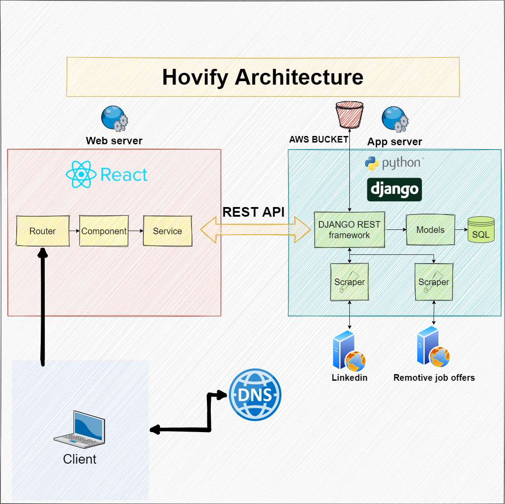

     

  

# Hovify 

> **(Not a job finder. More like a job matcher.)**

Hovify is a web platform created to help developers to save time in repetitive work like job searching, with the scraping technology and Linkedin connection it automatizes user's resume creation and job appliance.

You can check our live site here: [hovify.works](https://hovify.works/)

Check our story here: [The story behind Hovify](https://www.linkedin.com/pulse/our-experience-launching-hovify-david-orejuela)

### Team 🎮

| [Nathaly Sotomayor](https://github.com/nathsotomayor)   DevOps & Software architect      | [Tatiana Orejuela](https://github.com/tatsOre/)     Front End - React Developer  |	[Juan Llano Gallego](https://github.com/llanojs/)   Front End - React Developer | [Andres Bayona](https://github.com/AndrewB4y)    Back End - Django Developer| [David Orejuela](https://github.com/daorejuela1)    Back End - Django Developer|
| -------------- | -------------- | ------------ |------------------- | --------- |
|    |    |   |  | 
|&nbsp;&nbsp;  &nbsp;  | &nbsp;&nbsp;&nbsp;&nbsp;&nbsp;&nbsp; &nbsp; |&nbsp;  &nbsp; |&nbsp;&nbsp;  &nbsp;  | &nbsp;&nbsp;  &nbsp; |

## Motivation 🏋

Created to improve the journey of programmers to join the professional world through the use of an automated service. This magic saves them time establishing their resume, helps them to keep organized Linkedin, and indulges them in using their time in learning new skills instead of manually applying to a lot of companies.

## Code style 👓

Javascript ☞  

Python3  ☞ 

## Screenshots  📷

## Welcome page

 

--------------

## Interests form

---

## Motivations form

---

## Sign up

---

## Resume builder

 

---

## API doc example

 

## Tech/framework used 🛠

- Django is used to control the database, communicate with the S3 AWS bucket and expose the API endpoints.

- React is used to handle the user experience/interface and interact with the API endpoints.

## Requirements 📚

- Ubuntu 18.04+
- MySQL 5.7+
- Python 3.6
- Node 12.19.0
- Npm 6.14.8
- Latexmk and dependencies to create the resumes: `apt-get install texlive-full latexmk`

## Installation & Init 📖

Please make sure that you define the following enviroment variables:

| Enviroment variable | Meaning |
|--|--|
| HOVIFY_DB | MySQL database name |
| HOVIFY_PASS| MySQL database password|
| HOVIFY_HOST| MySQL database URL|
| HOVIFY_PORT| MySQL database Port|
| USER_LINKEDIN| Linkedin e-mail to use |
| PASS_LINKEDIN| Linkedin password to use |
| AWS_KEY_ID| AWS IAM key ID with S3 permissions |
| AWS_KEY_SECRET| AWS IAM secret key with S3 permissions |
| AWS_BUCKET_NAME| S3 Bucket name to use |

1. Clone the repository: `git clone https://github.com/tatsOre/hovify.git`
2. Install python libraries: `pip3 install -r requirements.txt`
2. Create the tables in the database: `python3 manage.py migrate`
3. Start the Django API: `python3 manage.py runserver`

In a new terminal start the react APP:

1. Go to the frontend folder `cd frontend/`
2. Install npm dependencies: `npm install`
3. Start the React app: `npm start`

## Usage 💪

Execute `python3 manage.py createsuperuser` to create an user with admin rights.

To check the data in the database you can use `127.0.0.1:5000/admin` and login with your user this will give you access to all the data the users has been producing in the app

Once the React app is running you can follow the React interface to create an User and render your own PDF resume.

---

By default Django will launch on the `127.0.0.1:5000` address you can access each endpoint in this format: `127.0.0.1:5000/api/v1/users`

### API Reference 📰

You can check the available endpoints for your user in the `/swagger-docs/` route.

Online API documentation can be found here:

[Hovify API swagger documentation](https://hovify.herokuapp.com/swagger-docs/)

## Features 📜
 
 -  Linkedin scraping system to create your user and resume from your Linkedin profile information.
 - Resume builder to give you a form-style structure to create the resume and render it to an PDF file.
 - Automatic apply system, whenever you create your profile your resume is send to jobs gather by us that match your profile.

## Contributing 🧍

Contributions are always welcome!

Please read the [contribution guidelines](CONTRIBUTING.MD) first.

## Related projects 💼

Here are some awesome projects we have been working on:

|[Mastermind Hackday Project](https://github.com/daorejuela1/mastermind)| [Airbnb Clone](https://github.com/AndrewB4y/AirBnB_clone_v4) | [Monty bytecode decoder](https://github.com/llanojs/monty) | [Printf](https://github.com/emmanavarro/printf) | [Custom Shell](https://github.com/tatsOre/simple_shell)
|--|--|--|--|--|
|  |  |  |  |  |

## Licensing 🔑

Released in 2020 by @[Hovify](http://hovify.works/)

## Credits ✈

Special thanks to [remotive.io](https://remotive.io/) for their awesome API, and [LinkedIn](https://www.linkedin.com/mynetwork/) for the outstanding platform.
